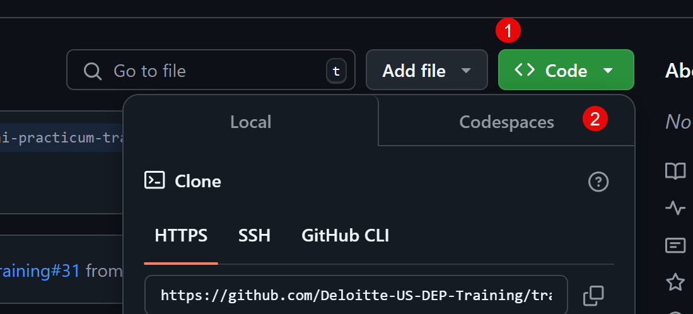
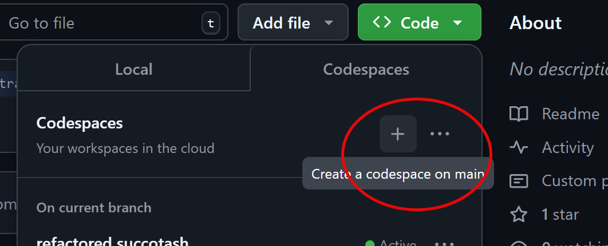
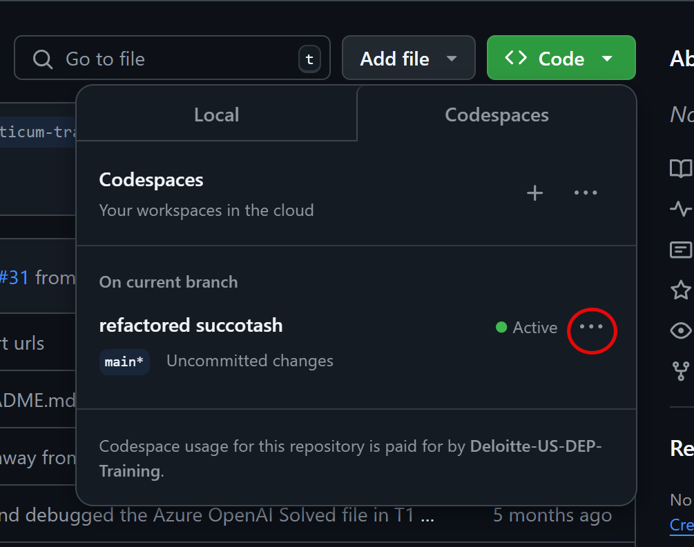

# GenAI Practicum - Track 1 - Labs

This code repository contains all the labs for Track 1 for the AI Guild GenAI Practicum

## Instructions

Fork this repo: https://github.com/Deloitte-US-DEP-Training/genai-practicum-track1-labs-cohort2

The forked repo is yours to do with as you will.

Create a Codespace in the forked repo.

If you forked from https://github.com/Deloitte-US-DEP-Training/genai-practicum-track1-labs-cohort2 then you will need to "Sync fork" in your repo.
 
If you forked from https://github.com/Deloitte-US-DEP-Training/track1-cohort2-skingaby then you will need to "Sync fork" in your repo.
 
Either way,  there's a button on the main Code page for that purpose.

 
Once your fork has been synced, you can safely create a Codespace. 
To do this, you will:
1) Pull down the dropdown on the big Green Code button.
2) Click the Codespace Tab.

3) Click the plus button to create a new Codespace.

4) A dialog will popup saying: This site is trying to open Visual Studio Code.
You have a choice to make.
If you decide to click Open, you will open the codespace in VS Code and it "should just work".
If you decide to click Cancel, you will open the codespace in the browser. These instructions assume the latter.
 
5) Click Cancel.
6) Click the back button in the browser.
7) Click on the Code button again.
8) Click on the Codespaces tab again.
9) Click on the ellipse next to the brand new codespace you have created. It will have a funky name like running giraffe, or something.

10) Scroll down and choose Open in Browser.
11) GitHub will setup the codespace.
12) Some time later, you will locate the Session 1 - Lab 1 - NLP Tasks folder and open the Solved folder, and open the NLP_Tasks_Solved.ipynb file. This will trigger your codespace to install  the Python and Jupyter extensions. After a few minutes, refresh your browser and those extensions will be installed. 
13) Feel free to install the GitHub Copilot extension as well.
14) Go grab a snack, a drink, or whatever you do to take a break because you have earned it.
